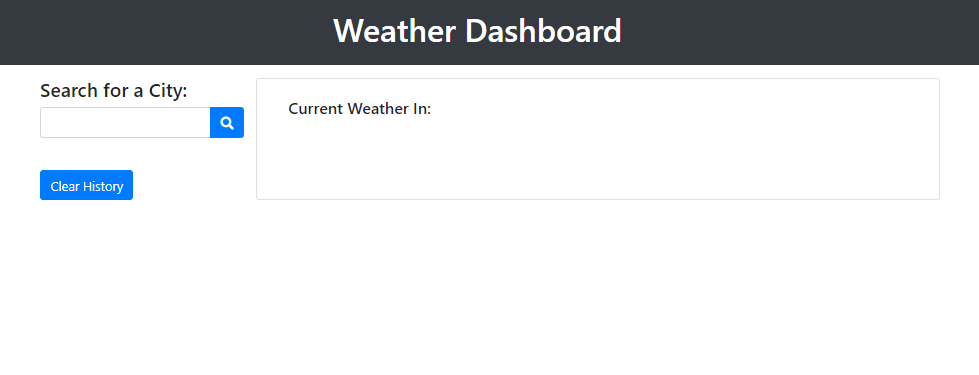
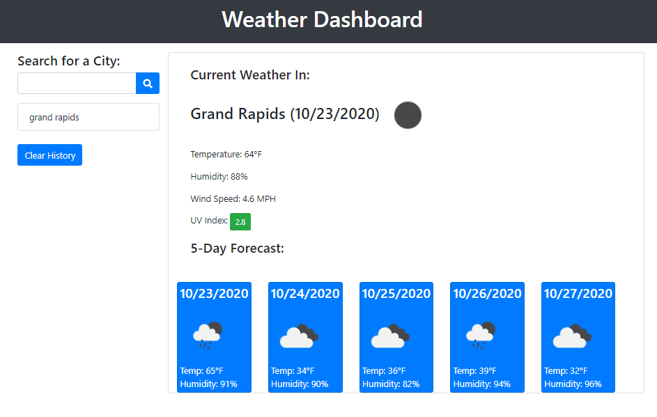

## Weather Dashboard

Alyson Bennett

## Link to Completed Project

[Link to deployed application](https://alysonbennett.github.io/WeatherDashboard.github.io/)

## User Story

- AS A traveler
- I WANT to see the weather outlook for multiple cities
- SO THAT I can plan a trip accordingly

## Acceptance Criteria

- GIVEN a weather dashboard with form inputs
- WHEN I search for a city
- THEN I am presented with current and future conditions for that city and that city is added to the search history
- WHEN I view current weather conditions for that city
- THEN I am presented with the city name, the date, an icon representation of weather conditions, the temperature, the humidity, the wind speed, and the UV index
- WHEN I view the UV index
- THEN I am presented with a color that indicates whether the conditions are favorable, moderate, or severe
- WHEN I view future weather conditions for that city
- THEN I am presented with a 5-day forecast that displays the date, an icon representation of weather conditions, the temperature, and the humidity
- WHEN I click on a city in the search history
- THEN I am again presented with current and future conditions for that city
- WHEN I open the weather dashboard
- THEN I am presented with the last searched city forecast

## Process

This assignment was started from scratch as there was no starter code. I began by setting up an API key for OpenWeatherMap. Links were needed for the current weather data, the 5 day forecast, and the UV index. From there, I started building my code to meet the criteria stated above.

Functions were needed to search for a city when clicked, to display the current weather conditions, and to display the five day forecast for that city.

Within the current weather card, the city, date, and icon representing the current conditions is displayed at the top. Underneath, the temperature, humidity, wind speed, and UV index is listed. All but the UV index were pulled from the response of the current weather data. The UV Index needed a separate API link (UV Index) as well as being color coded for favorable, moderate, or severe conditions.

The five day forecast has five different cards within a card deck. Each has a date as the title, with an icon, the temperature, and humidity listed below.

I also included a clear history button. This button deletes the local storage as well as the current weather and forecast sections.

## Screen Shots of Final Assignment

This is what the user will see when they first open the Weather Dashboard site:

This is what the user will see when they search for a city:

## Final Thoughts

This was a challenging activity and there were some bugs that took quite a bit of time to work out. The first bug is getting button colors to change for the UV index with the conditions of favorable, moderate, and severe. The second bug was getting the forecast to append to five separate cards in the card deck.

Overall, I am very happy with the final product of this homework assignment. While I would have liked to add some extra styling, the bootstrap elements still provide a polished looking site.
